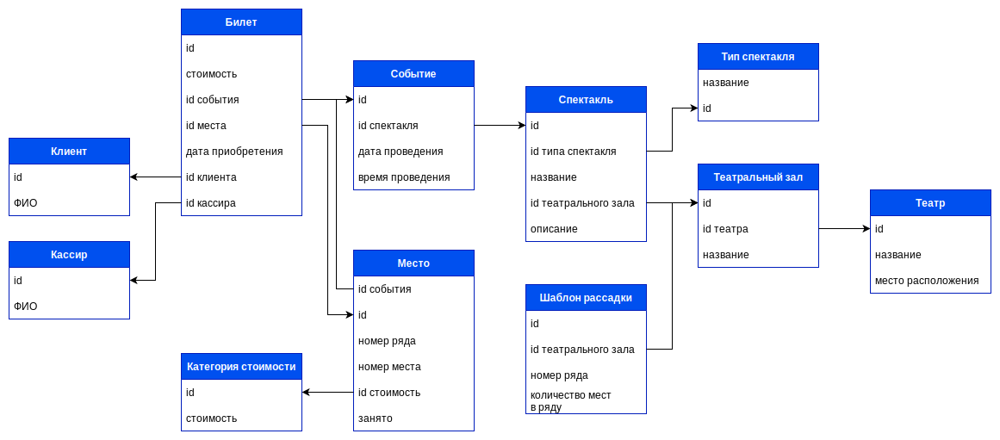

# database-exam
Репозиторий с решением задачи с экзамена по базам данных

## Задача
Разработать инфологию ИС (информационную систему) "Театральная касса". Она должна уметь предоставлять информацию о театрах и их репертуарах, а также продавать билеты. Система должна уметь предоставлять отчетность о проданных билетах и успехах отдельных кассиров

## Инфология

## Алгоритм добавления нового театра
1. Добавляем теат
    1. Название
    2. Место расположения
2. Добавляем театральный зал / театральные залы
    1. Название
    2. Шаблон / шаблоны рассадки

## Алгоритм добавления нового события
1. Добавляем спектакль, если его еще нет в системе
    1. Спектакль имеет свой тип, например, опера
    2. Название
    3. Описание
    4. Театральный зал
2. Добавляем событие и связываем его со спектаклем
    1. Спектакль
    2. Дата проведения
    3. время проведения
3. Генерируем места по одному из шаблонов рассадки театрального зала спектакля
    1. Клиентское приложение запрашивает шаблоны рассадки и категории стоимости
    2. Администратор выбирает один из имеющихся шаблонов или добавляет новый
    3. Администратор указывает категории стоимости каждого места
    4. Клиентское приложение отправляет получившиеся места на веб-серверное приложение, которое генерирует соответствующий запрос к СУБД

## Алгоритм продажи билета
1. Выбор места
    1. Клиентское приложение получает места, связанные с выбранным событием, и их стоимости
    2. Пользователь выбирает место
    3. Информация о выборе пользователя отправляется на веб-серверное приложение
2. Добавляем билет
    1. Связываем с событием
    2. Связываем с местом и отмечаем место занятым
    3. Добавляем стоимость места на данный момент без связи с таблицей (так нужно сделать для обработки случаев, когда билет уже купили, а затем стоимость поменялась)
    4. Дата приобретения
    5. Клиент
    6. Кассир